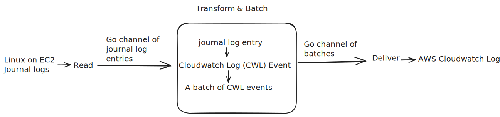

# Journald-to-cwl

`journald-to-cwl` pushes journald logs from EC2 instances to AWS CloudWatch Logs (CWL). In production, run it as 
a systemd service. It operates as a simple linear Extract → Transform → Load process.



Simplicity in design leads to robustness.

1. For simplicity, the CWL log group and EC2 instance must be in the same AWS region and belong to the same AWS account.

1. For simplicity, it does not provide filtering configurations for log entries by priority, entry keys, or regular expressions. 
It pushes all journald logs to CWL. If you need to filter logs (e.g., to exclude sensitive information), 
configure [systemd logging](https://www.freedesktop.org/software/systemd/man/latest/systemd.exec.html#Logging%20and%20Standard%20Input/Output) directly.

1. For simplicity, it uses permissions from the EC2 instance profile.

1. For simplicity, it does not accept command-line flags. Instead, it reads an env-style configuration file:
```
log_group = ""      # CWL log group name
log_stream = ""     # CWL log stream name
state_file = ""     # Text file that persists the state
skip_audit_log = "" # Skip audit logs (default: false)
```
The default configuration is:
```
log_group = "journal-logs"
state_file = "/var/lib/journald-to-cwl/state"
log_stream = "<instance-id>"  # e.g., "i-11111111111111111"
skip_audit_log = false
```

## Installation
You can download the Go binary and RPM package from the Release page or build from source.
```sh
# Install C headers
yum install systemd-devel

# Install Go and build the binary
go mod tidy
make build-go

# Install rpmbuild tools and build the RPM package
yum install rpmdevtools rpmlint
make build-rpm
```

Install:
```sh
# Use the RPM you downloaded or built
sudo rpm -ivh journald-to-cwl-0.1.0-1.amzn2.x86_64.rpm

# Modify the config file if needed
cat /etc/journald-to-cwl/journald-to-cwl.conf

sudo systemctl start journald-to-cwl
```

Example log event in CWL:
```json
{
    "instanceId": "i-11111111111111111",
    "realTimestamp": 1728886624050615,
    "pid": 10993,
    "uid": 1000,
    "gid": 0,
    "cmdName": "sudo",
    "exe": "/usr/bin/sudo",
    "systemdUnit": "session-1.scope",
    "bootId": "a1111111111111111111111111111111",
    "machineId": "b1111111111111111111111111111111",
    "hostname": "ip-101-01-01-01.us-west-2.compute.internal",
    "transport": "syslog",
    "priority": "info",
    "message": "pam_unix(sudo:session): session closed for user root",
    "syslog": {
        "facility": 10,
        "ident": "sudo"
    }
}
```

## Code Structure
The design is as simple as a typical ETL, and the implementation uses a root Context and two Go channels for coordination:
1. **Extract** (`journal/reader.go`): Reads journal entries into a channel `entries`.
2. **Transform and Batching** (`batch/batch.go`): Consumes from the `entries` channel, transforms entries into log events 
for CWL, and batches events into a channel of `batches`.
3. **Load** (`cwl/writer.go`): Consumes from the `batches` channel and sends each batch to CWL.

## FAQ

**Q1. Where do the logs of journald-to-cwl go?**

If you run it as a systemd service and do not set `StandardOutput` and `StandardError` in `journald-to-cwl.service`, 
the logs go to journald and are later read by `journald-to-cwl` itself. That's why journald-to-cwl does not log excessively—
otherwise, it could DoS itself.

**Q2. Why do I need journald-to-cwl?**

You need to push journal logs to CWL and don't want to set up "do-it-all" tools like [OTEL](https://opentelemetry.io/)
or [Vector](https://vector.dev/). Note that [amazon-cloudwatch-agent](https://docs.aws.amazon.com/AmazonCloudWatch/latest/monitoring/Install-CloudWatch-Agent.html) does not support journal logs.

**Q3. journald-to-cwl seems to do the same thing as [journald-cloudwatch-logs](https://github.com/saymedia/journald-cloudwatch-logs). Why would I choose journald-to-cwl?**

journald-cloudwatch-logs has not been updated since 2017 and has several issues for production use:
  1. **Outdated SDK**: [aws-sdk-go](https://github.com/aws/aws-sdk-go?tab=readme-ov-file#warning-this-sdk-is-in-maintenance-mode) 
entered maintenance mode on July 31, 2024 and will reach end-of-support on July 31, 2025. In maintenance mode, the SDK will not 
receive API updates for new or existing services or support for new regions.
  2. **Build issues**: It does not build with Go 1.22+. The latest commit relies on vendor, but starting with 
[Go 1.22](https://go.dev/doc/go1.22), `go mod init` no longer imports module requirements from 
configuration files for other vendoring tools (such as Gopkg.lock).
  3. **No release version**
  4. **No LICENSE**, which is a risk for production use
  5. **No tests**, yet many TODO comments
  
